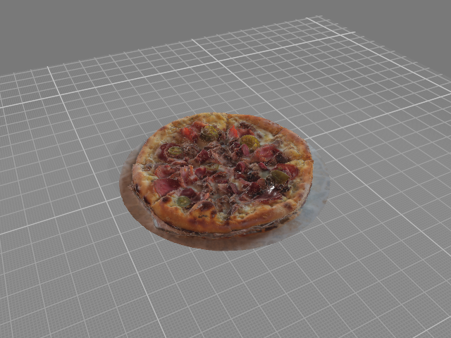

# AR Restaurant Menu
Experience our dishes in Augmented Reality. Scan, view, and explore our menu items in 3D right on your table.

## Features
- 🎯 **3D Model Viewer** - View dishes in stunning 3D detail using Google's Model Viewer
- 📱 **Augmented Reality** - Place dishes on your table using WebXR/AR
- 📲 **PWA Support** - Install as a Progressive Web App for offline access
- 🔗 **Shareable Links** - Share specific dishes via URL parameters
- 🎨 **Responsive Design** - Works seamlessly on mobile and desktop
- ⚡ **Fast Loading** - Optimized assets with loading states and error handling
## Available Dishes
| Dish | Price | Prep Time | Calories |
|------|-------|-----------|----------|
| Butter Chicken | $19.00 | 20 min | 740 kcal |
| Pad Thai | $17.50 | 14 min | 620 kcal |
| Peking Duck Wrap | $26.00 | 25 min | 680 kcal |
| Tomato Bruschetta | $9.50 | 6 min | 290 kcal |
| Soup Dumplings | $12.00 | 12 min | 320 kcal |
| Burger | $15.00 | 10 min | 850 kcal |
| Pasta | $18.00 | 15 min | 720 kcal |
| Pizza | $20.00 | 12 min | 900 kcal |
| Steak | $32.00 | 18 min | 650 kcal |
| Sushi Platter | $24.00 | 20 min | 480 kcal |
## Usage
### Viewing a Dish
Navigate to the website with a dish ID:
```
https://your-domain.com/?dish=butter_chicken
```
Supported dish IDs:
- `butter_chicken`
- `pad_thai`
- `peking_duck`
- `bruschetta`
- `soup_dumpling`
- `burger`
- `pasta`
- `pizza`
- `steak`
